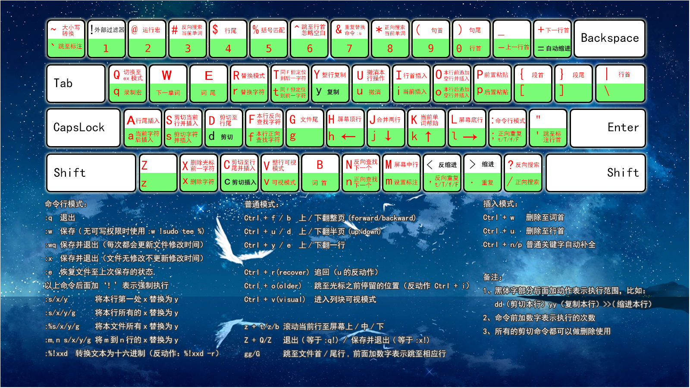

### 基础命令

* ls

* cd 

* pwd

* mkdir

* cp

* cat

* rm

* sudo

* env  

  查看当前环境变量

* pkg-config

主要设置路径：

* path

* pkg-config_path

* ld_library_path

  

  

### 基础工具

apt

brew

yum

### Vim基础

* 三大模式

1. Command mode
2. Insert mode
3. Last line mode

* 引用

[菜鸟教程](https://www.runoob.com/linux/linux-vim.html)

* 壁纸图片

